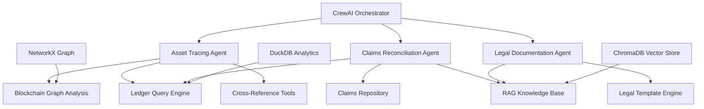

# 🏛️ Compliance Analysis
## Multi-Agent Crypto Bankruptcy Assistant

*Crafted for **Alvarez & Marsal** by **TurboQuant***

---

### 🎯 **Purpose**

A sophisticated multi-agent AI system designed specifically for cryptocurrency bankruptcy proceedings and regulatory compliance work. Built using CrewAI orchestration, this solution mimics an entire compliance department's workflow through specialized AI agents that collaborate to assess, trace, and document complex financial scenarios.

**Perfect for complex and dense crypto bankruptcies, regulatory investigations, and asset recovery operations.**

---

### ✨ **Key Features**

#### 🔍 **Asset Tracing Agent**
- **On-chain & Off-chain Analysis**: Reconstructs asset flows across blockchain networks and traditional ledgers
- **Forensic Blockchain Intelligence**: Expert in clustering, peel chains, and cross-platform reconciliation
- **Evidence-Based Reporting**: Produces detailed flow diagrams with transaction hash citations

#### 📊 **Claims Reconciliation Agent** 
- **Automated Claim Verification**: Reconciles creditor assertions against reconstructed balances
- **Delta Analysis**: Identifies discrepancies with detailed rationale and supporting evidence
- **Audit Trail Generation**: Maintains comprehensive documentation for regulatory review

#### 📝 **Legal Documentation Agent**
- **Court-Ready Reports**: Drafts neutral, well-cited legal documents with precise appendices
- **Citation Management**: Maintains source references to all evidence and methodologies
- **Compliance Standards**: Adheres to bankruptcy court documentation requirements

---

### 🏗️ **Architecture**



**Core Technologies:**
- **CrewAI**: Agent orchestration and workflow management
- **Ollama**: Local LLM inference (Llama 3.1 8B)
- **ChromaDB**: Vector storage for knowledge retrieval
- **DuckDB**: High-performance analytics on ledger data
- **NetworkX**: Graph analysis for blockchain tracing
- **FastAPI**: RESTful API interface

---

### 🎪 **Demo Scenarios**

#### **FTX-Style Crypto Bankruptcy**
- **Target**: Customer C123 with Bitcoin holdings
- **Tracing**: `exch_hot_1 → 0xabc → 0xrelay1 → 0xprime`
- **Output**: Complete asset flow with 3+ intermediary hops
- **Result**: Court-ready exhibit with full citation trail

#### **Claims Processing**
- **Input**: Customer assertions vs. reconstructed ledgers  
- **Analysis**: Automated reconciliation with ±0.0001 precision
- **Output**: Reconciliation CSV + detailed methodology memo

---

### 🚀 **Quick Start**

#### **Prerequisites**
- Docker & Docker Compose
- Python 3.9+
- 8GB+ RAM (for local LLM)

#### **Setup**
**🚀 Automated Setup (Recommended):**
```bash
# 1. Clone repository
git clone https://github.com/turboquant/crewai_trio_am.git
cd crewai_trio_am

# 2. Run setup script
./setup.sh        # Linux/Mac
# OR
setup.bat         # Windows
```

**🔧 Manual Setup:**
```bash
# 1. Install dependencies
pip install -r requirements_real.txt

# 2. Start Docker containers
docker compose -f docker-compose.real.yml up -d

# 3. Launch interactive chat
python interactive_demo.py
```

#### **💬 Usage**
Interactive AI-powered compliance analysis:
- **Direct Commands**: `/balance C123 BTC`, `/claims`, `/wallet 0xabc`, `/assets`
- **Natural Language**: *"How much BTC does customer C123 have?"*, *"Show unreconciled claims"*
- **System Tools**: `/test` (health check), `/help` (commands), `/search` (knowledge base)
- **Complete Analysis**: Real-time asset tracing, claims reconciliation, legal research

See `QUICKSTART.md` for detailed command reference.

---

### 📋 **Use Cases**

#### **For Alvarez & Marsal Professionals:**

**🏦 Cryptocurrency Bankruptcies**
- Asset tracing across DeFi protocols and centralized exchanges
- Customer fund reconstruction from fragmented data sources
- Regulatory compliance documentation for court proceedings

**💼 Financial Investigations**
- Cross-platform transaction analysis
- Entity resolution and beneficial ownership mapping  
- Evidence compilation for litigation support

**📊 Regulatory Compliance**
- Automated assessment of regulatory changes
- Policy impact analysis and recommendation generation
- Documentation standardization across case teams

**⚖️ Litigation Support**
- Expert witness report preparation
- Evidence organization and citation management
- Technical analysis translation for legal audiences

---

### 🔬 **Technical Specifications**

#### **Data Sources**
- **Ledger Files**: Spot/margin trading records (CSV)
- **Blockchain Data**: On-chain transaction histories
- **Claims Database**: Customer assertions and status tracking
- **Knowledge Base**: Court filings, regulatory documents, policy templates

#### **Processing Capabilities**
- **Graph Analysis**: Multi-hop transaction path discovery
- **Balance Reconstruction**: Point-in-time asset calculations
- **Entity Resolution**: Wallet-to-customer mapping with confidence scoring
- **Citation Tracking**: Source-to-conclusion audit trails

#### **Output Formats**
- **Structured Data**: CSV reconciliation tables, JSON audit logs
- **Narrative Reports**: Markdown documentation with embedded citations
- **Legal Exhibits**: Court-formatted appendices and evidence tables

---

### 🛡️ **Security & Compliance**

#### **Data Protection**
- **Local Processing**: No sensitive data leaves your infrastructure
- **PII Scrubbing**: Automated redaction of personal information
- **Access Control**: Environment-based security configuration

#### **Audit Requirements**
- **Complete Traceability**: Every output linked to source evidence
- **Reproducible Results**: Identical inputs produce identical outputs
- **Compliance Logging**: SQLite audit database with timestamped entries

---

### 🤝 **About TurboQuant**

**TurboQuant** is a specialized AI consulting firm focused on building cutting-edge solutions for financial services, regulatory compliance, and complex data analysis. We combine deep domain expertise in finance and law with advanced AI engineering to deliver practical, production-ready systems.

**Our Mission**: Transform how professional services firms handle complex analytical work through intelligent automation and AI-powered insights.

---

### 🏢 **Partnership with Alvarez & Marsal**

This system was developed specifically for **Alvarez & Marsal's** restructuring and investigation practices, incorporating:

- **Industry Best Practices**: Built-in compliance with bankruptcy court standards
- **Scalable Architecture**: Designed for enterprise deployment across case teams  
- **Domain Expertise**: Trained on relevant legal and financial documentation patterns
- **Professional Integration**: API-first design for existing workflow integration

---

### 📞 **Support & Contact**

#### **Technical Support**
- **Documentation**: See `/docs` directory for detailed guides
- **Issues**: Submit via GitHub Issues with debug logs
- **Training**: Custom training sessions available for A&M teams

#### **Business Inquiries**
- **TurboQuant Consulting**: [carlos@turboquant.ai]
- **Feature Requests**: Priority development for A&M use cases
- **Integration Support**: Professional services for enterprise deployment

---

### 📄 **License & Compliance**

**Enterprise License**: This software is licensed for use by Alvarez & Marsal and authorized personnel only. 

**Regulatory Notice**: Users are responsible for ensuring compliance with applicable laws and regulations in their jurisdiction. This tool provides analytical assistance but does not constitute legal advice.

---

*Built with ❤️ by **TurboQuant** for **Alvarez & Marsal***

**Version**: 1.0.1 | **Last Updated**: September 2025